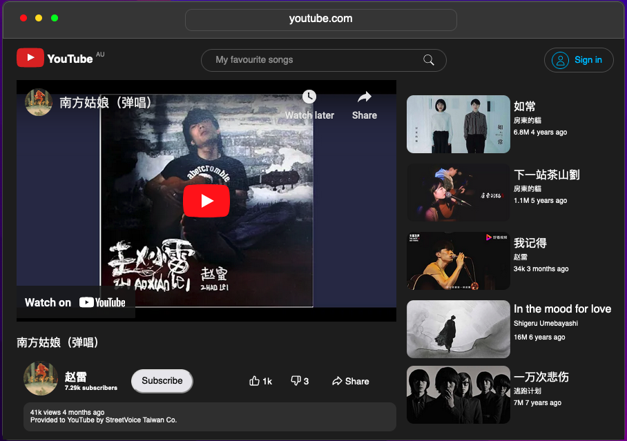

# FakeOS-macOS

An interactive browser clone of the dark themed macOS Monterey operating system.

 ## Introduction

 This project is a single page application that attempts to replicate the interactions and stylings of MacOS Monterey using vanillia JavaScript, HTML and CSS/SCSS. 

 The layout and format of the design is replicated using CSS and SCSS, the content is added with HTML and the interactive elements are controlled with JavaScript. 

#### Features

* Integrated Youtube clone in "Safari app"
   
    - Video and Audio can be played
    - Replicates the style of Youtube
* Personal Projects in "Finder app"

   - Contains my Resume as a download
   - Links to Personal Website and Projects (will be embedded internally in next update)
* Personal contact details in "Contacts app" 

   - Links to my email. LinkedIn, and Github
* Replicates the styling of MacOS Monterey in dark theme
* Selectable app icons
* Selecting an icon will open an "app", creating a modal to display some content
* Apps are draggable and can be closed/opened 
* Selectable menu
* Selecting the menu will display a list of text and icons
* The current time is displayed

